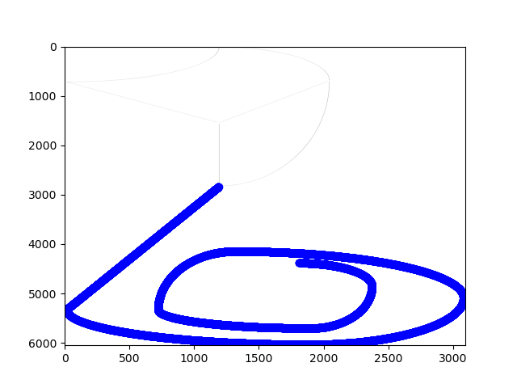

#  Laboratory Assignment Repository
Solution to the Laboratory Assignment 1 submitted in partial fulfillment of the requirements for the course in Robotics 2022/2023 at Instituto Superior Técnico - Lisbon University.

# Abstract

# Instructions
## Execution Guidelines
The connection with the robot should be established through the USB cable.

Before executing run:

```
$ python serial_ports.py
```

to confirm which serial port the Scorbot-ER7 is being detected at. If the dected port is 'COM4' no alterations are needed. Otherwise, in the the file actions.py on line 41, where the connection is being made, substitute 'COM4' by the correct port.

To run the program, the user must merely run the command:
```
$ python main.py -i image
```
where 'image' is the name and directory of the image for the robot to draw.


## Requirements

In order to run this software, some external python libraries might be required. To install them
simply run:
```
$ pip3 install -r requirements.txt
```

# Results
The results are showcased under the directory '/results'. The submitted report as well as videos of the robot and scannings of the produced drawings can be found in the folder (these latter correspond to the ones referenced in the report).

## Trajectory Planning
The following is a representation of the robot's planned trajectory from one of the given test images.


## SCORBOT-ER7 Movement


