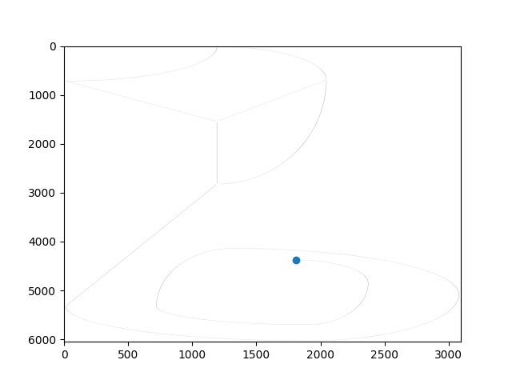

#  Laboratory Assignment Repository
Solution to the Laboratory Assignment 1 submitted in partial fulfillment of the requirements for the course in Robotics 2022/2023 at Instituto Superior Técnico - Lisbon University.

# Abstract
The development of the project is explained in this paper, which is based on solving a drawing task on a robotic arm with 5 rotational degrees of freedom (DOF), Scorbot ER-7, while demonstrating the importance of kinematic models. 
The goal of this project is to have the robot, which is grabbing a marker, draw an input image over a flat paper surface. 

By taking an image of a one-line black-and-white drawing, it is expected to select a set of points that the marker must touch. In order to do so, various image processing techniques are used such as thinning, finding of key points, and sampling. Next, the coordinates are fed to the robot and saved using the appropriate commands. Finally, it is expected that the robot draws the reference image, as accurately as possible. 
       
While developing the project, we reached a set of parameters. These are tuned in order to achieve the desired drawing, such decisions are described thoroughly. Additionally, besides only drawing the line, we implemented another feature, where the gripper rolls along the trajectory.
       
The robot was programmed using Python3 with the serial library and connected to a computer through a USB cable. The image processing and trajectory planning were also performed in Python, and the connection with the robot was ensured through the wait time to read each command.

Overall, the Scorbot ER-7 demonstrates strong potential as a drawing robot. However, the robot's memory could be compromised by too complex images that require heavy sampling.
The robot's performance is evaluated in terms of accuracy and speed and was found to be generally on par with other similar robots.

## Keywords 
Scorbot ER-7, Serial Manipulator, Image Processing, One line drawing

# Code organization

The code in this repository is organized into the following directories and files:

The current directory contains the source code for the robot.
  - `main.py`: The main entry point for the program.
  - `trajectory_planning.py`: A module containing functions for image processing and planning the robot's trajectory.
  - `actions.py`: A module containing functions for ordering the robot's movements and processes.
  - `serial_ports.py`: To test in which port the Scorbot -ER7 is detected.


# Instructions
## Execution Guidelines
The connection with the robot should be established through the USB cable.

Before executing run:

```
$ python serial_ports.py
```

to confirm which serial port the Scorbot-ER7 is being detected at. If the dected port is 'COM4' no alterations are needed. Otherwise, in the the file actions.py on line 41, where the connection is being made, substitute 'COM4' by the correct port.

To run the program, the user must merely run the command:
```
$ python main.py -i image
```
where 'image' is the name and directory of the image for the robot to draw.


## Requirements

In order to run this software, some external python libraries might be required. To install them
simply run:
```
$ pip3 install -r requirements.txt
```

# Results
The results are showcased under the directory '/results'. The submitted report as well as videos of the robot and scannings of the produced drawings can be found in the folder (these latter correspond to the ones referenced in the report).

## Trajectory Planning
The following is a representation of the robot's planned trajectory from one of the given test images.


## SCORBOT-ER7 Movement


